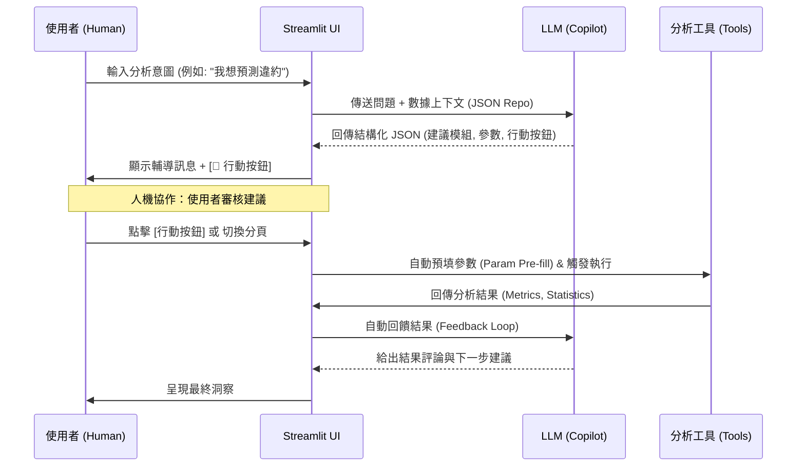

# 🤖 AI Copilot 互動流程說明 (Interaction Workflow)

本專案已從傳統的「對話與工具分離」架構，升級為 **Human-AI Collaboration (Copilot)** 模式。以下說明新的互動流程與背後的設計機制。

## 核心流程 (Core Flow)



## 關鍵機制說明

### 1. 結構化指令集 (Structured JSON JSON Routing)
不再僅依賴關鍵字匹配。LLM 會根據當前數據的欄位特性，直接指定目標模組與建議參數。
- **範例輸出**：
  ```json
  {
    "target_module": "ml",
    "suggested_params": {"model_name": "XGBoost", "target_col": "default_flag"},
    "actions": [{"label": "🤖 執行 XGBoost 建模", "module": "ml", "params": {...}}]
  }
  ```

### 2. 行動按鈕 (Actionable Buttons)
對話框下方會出現由 AI 動態生成的按鈕。這些按鈕**直接連結系統內建的功能函式**（如 `ml_models.py` 中的訓練邏輯），點擊後即可「一鍵執行」，省去手動設定參數的時間。

### 3. 參數預填 (Parameter Pre-fill)
當進入「統計分析」或「機器學習」分頁時，AI 建議的欄位與參數會自動選中。
- **優點**：保留使用者的主控權（Know-how 審核），同時極大化分析效率。

### 4. 雙向回饋循環 (Two-way Feedback Loop)
工具執行的結果（如模型的 Accuracy、F1-Score 或統計的 P-value）會自動封裝並回傳給 LLM。AI 會扮演專業顧問的角色，告訴您這個結果代表什麼意義，以及該如何優化。

## 如何測試新流程
1. **上傳數據**：從側邊欄載入資料。
2. **提出目標**：在聊天框輸入「幫我看看年齡跟收入的關係」或「我想預測 [目標欄位]」。
3. **執行建議**：點擊回覆下方的「📊 執行敘述統計」或「🤖 建立模型」按鈕。
4. **獲取洞察**：觀察工具執行完後，AI 如何針對結果給出進一步建議。
